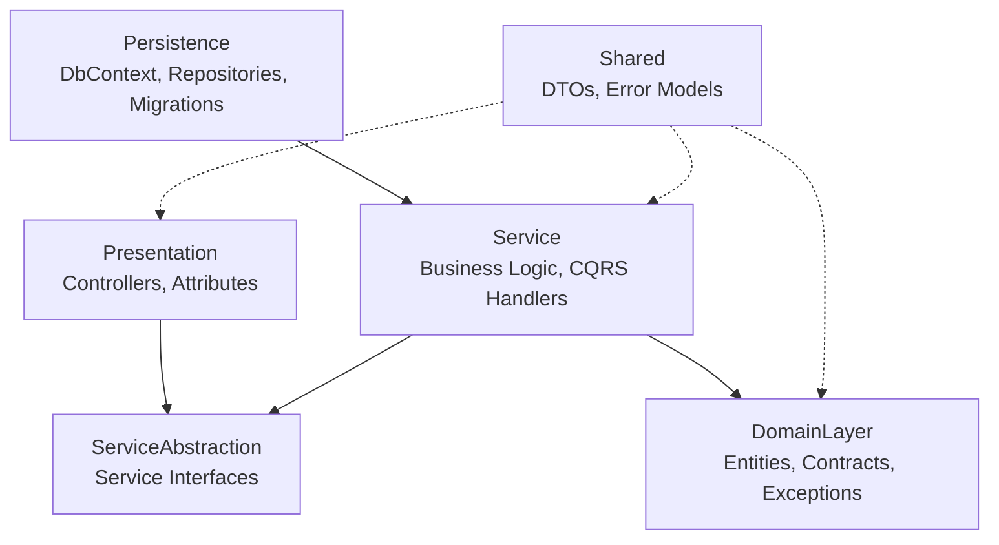

# ECommerce

A RESTful e-commerce backend API built with **ASP.NET Core** following **Clean Architecture** principles, featuring product catalog management, a Redis-backed shopping basket, order processing, Stripe payments, and JWT authentication.


> Badges above are limited to what can be confirmed from the repository (target frameworks, database, and cache technology). No CI, license, or release badges are included because no corresponding configuration exists in the repository.

---

## Table of Contents

- [Overview](#overview)
- [Features](#features)
- [Architecture](#architecture)
- [Technology Stack](#technology-stack)
- [Project Structure](#project-structure)
- [Requirements](#requirements)
- [Getting Started](#getting-started)
- [Database Setup](#database-setup)
- [Running the Application](#running-the-application)
- [API Documentation](#api-documentation)
- [API Endpoints](#api-endpoints)
- [Authentication & Authorization](#authentication--authorization)
- [Configuration](#configuration)
- [Caching](#caching)
- [Logging & Error Handling](#logging--error-handling)
- [Validation](#validation)
- [Development Guidelines](#development-guidelines)
- [Security](#security)
- [Known Limitations](#known-limitations)
- [Roadmap](#roadmap)
- [License](#license)

---

## Overview

**ECommerce** is a backend API for an online store. It exposes endpoints for browsing a product catalog, managing a shopping basket, placing orders, and processing payments through Stripe, with user accounts secured via JWT-based authentication.

The project is intended for:
- Developers who want a reference implementation of Clean Architecture + Repository/Specification/Unit of Work patterns in ASP.NET Core.
- Frontend/mobile developers who need an API to integrate against.
- Anyone extending it into a full e-commerce solution.

**Core capabilities:**
- Product catalog with filtering, sorting, and pagination
- Persistent basket storage using Redis
- Order creation and retrieval, with configurable delivery methods
- Stripe payment intent creation and webhook-driven order status updates
- User registration/login with JWT, plus address management
- Response caching and centralized error handling

---

## Features

- **JWT Authentication** — register, login, and access protected endpoints using bearer tokens
- **ASP.NET Core Identity** — user accounts stored in a dedicated Identity database, with role support (`SuperAdmin`, `Admin` roles are seeded)
- **Product Catalog** — list products with pagination, filter by brand/type, search by term, and sort by price/name
- **Shopping Basket** — add, update, retrieve, and delete a basket, persisted in Redis (not SQL)
- **Order Management** — create orders from a basket, list a user's orders, retrieve delivery methods, fetch a single order by ID
- **Stripe Payment Integration** — create/update a `PaymentIntent` tied to a basket, and handle Stripe webhook events (`payment_intent.succeeded`, `payment_intent.payment_failed`) to update order status
- **Response Caching** — a custom `[CacheAttribut]` action filter caches GET responses in Redis for a configurable duration
- **Centralized Exception Handling** — a custom middleware maps domain exceptions to consistent JSON error responses
- **Data Seeding** — brands, types, and products are seeded from JSON files on startup; Identity roles/users are seeded on first run
- **API Documentation** — Swagger / OpenAPI UI available in the Development environment
- **AutoMapper** — entity ↔ DTO mapping via defined mapping profiles
- **CQRS (partial)** — basket operations are implemented as MediatR commands/queries

---

## Architecture

The solution follows **Clean Architecture**, split into four layers with a strict inward dependency direction (outer layers depend on inner layers, never the reverse):



| Layer | Project | Responsibility |
|---|---|---|
| **Domain** | `Core/DomianLayer` | Entities (`Product`, `Basket`, `Order`, `ApplicationUser`, ...), repository/service contracts (`IUnitOfWork`, `IGenericRepository`, `ISpecification`), and domain exceptions |
| **Application** | `Core/Service`, `Core/ServiceAbstraction` | Business logic, service interfaces, MediatR command/query handlers for the basket, AutoMapper profiles, specifications |
| **Infrastructure (Persistence)** | `Infrastructure/Persistence` | EF Core `DbContext`s, repository implementations, migrations, Redis-backed basket/cache repositories, data seeding |
| **Infrastructure (Presentation)** | `Infrastructure/Presentation` | API Controllers and the custom caching action filter |
| **Shared** | `Shared` | DTOs, error models, and query-parameter types used across layers |
| **Host** | `ECommerce` (Web project) | `Program.cs` composition root, DI registration extensions, exception-handling middleware |

### Patterns actually used in the code

- **Generic Repository + Unit of Work** — `IGenericRepository<T,TKey>` and `IUnitOfWork` abstract data access for all entities.
- **Specification Pattern** — `ISpecification<T>` / `BaseSpecification<T>` build filtered, sorted, paginated, and eager-loaded queries (e.g. `ProductWithBrandAndTypeSpecification`, `OrderWithPaymentIntentIdSpecification`).
- **CQRS via MediatR** — implemented for the **Basket** feature only (`AddOrUpdateBasketCommand`, `DeleteBasketCommand`, `GetBasketQuery` and their handlers). Other features (Products, Orders, Payments, Authentication) call service methods directly, not through MediatR.
- **Dependency Injection** — services, repositories, and the caching/Identity/JWT infrastructure are registered via extension methods (`AddApplicationService`, `AddInfrastructureServices`, `AddJWTService`).
- **Factory pattern** — `ApiResponseFactory` builds a consistent validation-error response shape.
- **Middleware pipeline** — a custom `ExceptionHandlerMiddleware` centralizes error handling.

---

## Technology Stack

| Technology | Purpose |
|---|---|
| **Language** | C# |
| **Framework** | ASP.NET Core (host project targets `net10.0`; class libraries target `net8.0`) |
| **Database** | SQL Server (two databases: application data + Identity) |
| **ORM** | Entity Framework Core 8 |
| **Authentication** | ASP.NET Core Identity + JWT Bearer (`Microsoft.AspNetCore.Authentication.JwtBearer`) |
| **Mediator / CQRS** | MediatR |
| **Object Mapping** | AutoMapper |
| **Caching** | Redis (`StackExchange.Redis`) — used for both the basket store and response caching |
| **Payments** | Stripe.NET |
| **API Documentation** | Swashbuckle (Swagger / OpenAPI) |

No testing framework, containerization, or dedicated logging library beyond `Microsoft.Extensions.Logging` was found in the repository.

---

## Project Structure

```text
ECommerce/
├── Core/
│   ├── DomianLayer/                 # Entities, contracts, domain exceptions
│   │   ├── Contracts/                # IUnitOfWork, IGenericRepository, ISpecification, IBasketRepository, ICachRepository, IDataSeeding, IBasketService
│   │   ├── Exceptions/                # NotFoundException, BadRequestException, ProductNotFoundException, etc.
│   │   └── Models/                    # Product, Basket, Order, ApplicationUser, Address, ...
│   ├── Service/                      # Business logic + CQRS handlers
│   │   ├── BasketFeatures/            # MediatR Commands/Queries for the basket
│   │   ├── MappingProfiles/           # AutoMapper profiles
│   │   ├── Specifications/            # Specification implementations
│   │   └── *Service.cs                # ProductService, OrderService, PaymentService, AuthenticationService, CashService
│   └── ServiceAbstraction/           # Service interfaces (IProductService, IOrderService, IPaymentService, ...)
│
├── Infrastructure/
│   ├── Persistence/                  # EF Core DbContexts, repositories, migrations, data seeding
│   │   └── Data/
│   │       ├── Configurations/        # EF entity configurations
│   │       └── Migrations/            # EF Core migrations (Store DB + Identity DB)
│   └── Presentation/                 # Controllers + the custom caching attribute
│       ├── Attributes/                # CacheAttribut
│       └── Controllers/               # AuthenticationController, ProductsController, BasketController, OrdersController, PaymentsController
│
├── Shared/                           # DTOs, error models, query parameters (referenced by every layer)
│
├── ECommerce/                        # ASP.NET Core Web host (composition root)
│   ├── CustomMiddlewares/             # ExceptionHandlerMiddleware
│   ├── Extensions/                    # ServiceRegistration, WebApplicationRegistration (DI setup)
│   ├── Factories/                     # ApiResponseFactory
│   ├── Program.cs
│   └── appsettings.json
│
└── ECommerce.sln
```

---

## Requirements

- [.NET SDK](https://dotnet.microsoft.com/download) matching the target frameworks (`net10.0` for the Web host, `net8.0` for the class libraries)
- SQL Server (LocalDB, Express, or full instance)
- Redis server (used for both the basket store and response caching)
- A Stripe account with a Secret Key and Webhook Endpoint Secret (only required to exercise the payment endpoints)

---

## Getting Started

### Clone

```bash
git clone https://github.com/Mahmoud-Amr11/ECommerce.git
cd ECommerce
```


## Database Setup

The project uses **two separate SQL Server databases**, each with its own `DbContext`:

- `StoreDbContext` — products, baskets metadata, orders, delivery methods
- `StoreIdentityDbContext` — ASP.NET Core Identity users and roles

Apply migrations for both contexts from the repository root:

```bash
dotnet ef database update --project Infrastructure/Persistence/Persistence.csproj --startup-project ECommerce/ECommerce.Web.csproj --context StoreDbContext

dotnet ef database update --project Infrastructure/Persistence/Persistence.csproj --startup-project ECommerce/ECommerce.Web.csproj --context StoreIdentityDbContext
```

### Data Seeding

On startup, `Program.cs` calls `SeedingData()`, which:
- Applies any pending migrations to `StoreDbContext`
- Seeds `ProductBrand`, `ProductType`, and `Product` records from JSON files in `Infrastructure/Persistence/Data/SeedData/`
- Seeds two Identity roles: `SuperAdmin` and `Admin`
- Seeds two default users (only if no users exist):

| Username | Email | Role |
|---|---|---|
| `superAdmin` | `superAdmin@gmail.com` | SuperAdmin |
| `Admin` | `Admin@gmail.com` | Admin |

> Both seeded accounts use a hardcoded password in the source code. **Do not use this seeding logic as-is in a production deployment** — change or remove the default credentials before deploying.

---

## Running the Application

```bash
dotnet restore
dotnet build
dotnet run --project ECommerce/ECommerce.Web.csproj
```

By default (`launchSettings.json`) the API listens on `http://localhost:5000` (and `https://localhost:5001` under the `https` launch profile), and the browser is launched directly to the Swagger UI.

No Dockerfile or `docker-compose.yml` was found in the repository, so no containerized run path is documented here.

---

## API Documentation

Swagger / OpenAPI is enabled in the **Development** environment via Swashbuckle. Once the app is running:

```
http://localhost:5000/swagger
```

For endpoints marked `[Authorize]`, obtain a JWT via `POST /api/Authentication/Login`, then authorize in Swagger using the returned token (`Bearer <token>`).

---

## API Endpoints

Routes below are taken directly from the controllers. Route parameter types shown in `{}` reflect the actual controller signatures.

```text
Authentication
POST   /api/Authentication/Login
POST   /api/Authentication/Register
GET    /api/Authentication/CheckEmail?email={email}
GET    /api/Authentication/CurrentUser          [Authorize]
POST   /api/Authentication/Address              [Authorize]
PUT    /api/Authentication/Address              [Authorize]

Products
GET    /api/Products                            [Authorize]  (supports brandId, typeId, sortingOption, searchTerm, PageIndex, PageSize)
GET    /api/Products/{id}
GET    /api/Products/brands
GET    /api/Products/types

Basket
POST   /api/Basket
GET    /api/Basket/{id}
DELETE /api/Basket/{id}

Orders
POST   /api/Orders/CreateOrder                  [Authorize]
GET    /api/Orders/AllOrders                    [Authorize]
GET    /api/Orders/DeliveryMethod
GET    /api/Orders/{id:guid}                     [Authorize]

Payments
POST   /api/Payments?basketId={basketId}
POST   /api/Payments/WebHook
```

### Notable request/response shapes

**`POST /api/Authentication/Register`**
```json
{
  "email": "user@example.com",
  "password": "string",
  "userName": "string",
  "displayName": "string",
  "phoneNumer": "string"
}
```

**`POST /api/Orders/CreateOrder`** (authenticated, email derived from JWT claims)
```json
{
  "basketId": "string",
  "delivrryMethodId": 1,
  "address": {
    "firstName": "string",
    "lastName": "string",
    "street": "string",
    "city": "string",
    "country": "string"
  }
}
```

**`GET /api/Products`** query parameters (`ProductQueryParams`): `brandId`, `typeId`, `sortingOption` (`PriceAsc`, `PriceDesc`, `NameAsc`, `NameDesc`), `searchTerm`, `PageIndex` (default `1`), `PageSize` (default `5`, capped at `10`).

---

## Authentication & Authorization

- Authentication is handled by **ASP.NET Core Identity** (`ApplicationUser`, stored in `StoreIdentityDbContext`) combined with **JWT Bearer tokens**.
- On successful login/registration, `AuthenticationService` issues a JWT (`UserDto.Token`) signed with a symmetric key from `JWTOptions:SecretKey`, validated against `JWTOptions:Issuer` and `JWTOptions:Audience`.
- Protected endpoints are marked with `[Authorize]` (current user, addresses, order creation/listing, product listing). The current user's email is read from the `ClaimTypes.Email` claim on each authorized request.
- Identity **roles** (`SuperAdmin`, `Admin`) are seeded, but no controller in the current codebase enforces role-based (`[Authorize(Roles = ...)]`) restrictions — authorization is currently limited to "authenticated vs. anonymous."
- No refresh-token endpoint or mechanism exists in the repository.

---

## Configuration

| Configuration | Description | Required |
|---|---|---|
| `ConnectionStrings:DefaultConnection` | SQL Server connection for the store database | Yes |
| `ConnectionStrings:IdentityConnection` | SQL Server connection for the Identity database | Yes |
| `ConnectionStrings:RedisConnection` | Redis connection string, used for basket storage and caching | Yes |
| `JWTOptions:SecretKey` | Symmetric key used to sign/validate JWTs | Yes |
| `JWTOptions:Issuer` | JWT issuer value | Yes |
| `JWTOptions:Audience` | JWT audience value | Yes |
| `stripe:SecretKey` | Stripe API secret key | Only for payment endpoints |
| `stripe:EndpointSecret` | Stripe webhook signing secret | Only for the webhook endpoint |
| `Urls:BaseUrl` | Base URL value present in configuration (not read elsewhere in the code) | No |

No secrets from the repository are reproduced above — replace all values with your own before running the project.

---

## Caching

Two independent Redis-backed caching mechanisms exist:

1. **Basket store** — `BasketRepository` persists `Basket` objects (as JSON) in Redis under the basket ID as the key. This is the primary storage for baskets; there is no basket table in the SQL database.
2. **Response caching** — the custom `[CacheAttribut]` action filter (`Infrastructure/Presentation/Attributes/CacheAttribut.cs`) can be applied to GET actions. On a cache hit it short-circuits the pipeline and returns the cached JSON; on a miss it lets the action execute and stores the resulting `ObjectResult` value in Redis.
   - **Cache key**: built from the request path plus sorted query-string parameters.
   - **Expiration**: configurable per-attribute via a `Duration` parameter (seconds), defaulting to `120`.
   - **Invalidation**: time-based only (TTL expiry) — there is no explicit cache-invalidation-on-write logic.

---

## Logging & Error Handling

- Logging uses the built-in `Microsoft.Extensions.Logging` (`ILogger<T>`), injected into `ExceptionHandlerMiddleware`.
- `ExceptionHandlerMiddleware` is registered early in the pipeline and:
  - Logs a warning and returns a structured 404 response when the response status is `404` with no matched endpoint.
  - Catches unhandled exceptions, logs them, and maps them to an HTTP status code:
    - `NotFoundException` → 404
    - `UnauthorizedAccessException` → 401
    - `BadRequestException` → 400
    - Anything else → 500
  - In `Development`, the real exception message is returned; otherwise a generic message is used.

**Example error response** (`ErrorToReturn`):
```json
{
  "statusCode": 404,
  "message": "The resource /api/Products/999 you are looking for does not exist",
  "errors": null
}
```

---

## Validation

Model validation uses standard **Data Annotations** (`[EmailAddress]`, `[Phone]`, etc. on DTOs such as `RegisterDto`, `LoginDto`). Invalid model state is intercepted by `ApiBehaviorOptions.InvalidModelStateResponseFactory`, configured in `ServiceRegistration.AddApplicationApiService` to produce a consistent validation error response via `ApiResponseFactory`.

---

## Development Guidelines

- New business logic belongs in `Core/Service`, exposed through an interface in `Core/ServiceAbstraction`.
- New basket-related operations should follow the existing MediatR command/query pattern under `Core/Service/BasketFeatures`.
- New entities go in `Core/DomianLayer/Models`, with EF configuration added under `Infrastructure/Persistence/Data/Configurations`.
- Data-access logic belongs behind `IGenericRepository`/`IUnitOfWork` or a dedicated repository interface in the Domain layer, implemented in `Infrastructure/Persistence/Repositories`.
- DTOs and cross-cutting shared types belong in `Shared`, not in the Domain or Service layers.

No `CONTRIBUTING.md`, branching strategy, or commit-convention document currently exists in the repository.

---

## Security

- Do not commit real secrets. `appsettings.json` in this repository currently contains a placeholder connection string and a sample JWT key — replace these with your own values (via user secrets or environment variables) before deploying.
- All state-changing and user-specific endpoints that should require authentication are marked `[Authorize]`; verify this remains true when adding new endpoints.
- The seeded default admin accounts use a hardcoded password (see [Data Seeding](#data-seeding)) — rotate or remove these before any non-local deployment.
- No `SECURITY.md`, dependency scanning, or automated security workflow exists in the repository.

---

## Known Limitations

- CQRS/MediatR is only applied to the Basket feature; other features use direct service calls.
- No automated tests (unit or integration) are present in the repository.
- No Docker/containerization support.
- No refresh-token mechanism — JWTs must be reissued via login once expired.
- Role-based authorization is seeded but not enforced on any endpoint.
- The Web host project targets `net10.0` while the class library projects target `net8.0` — confirm this mismatch is intentional for your environment before building.
- The `stripe` configuration section is required by `PaymentService` but is not present in the default `appsettings.json`.

---

## Roadmap

No roadmap or TODO list is defined in the repository. The items below reflect gaps identified in [Known Limitations](#known-limitations) rather than stated project plans:

- [x] Product catalog with pagination/filtering/sorting
- [x] Basket management (Redis-backed)
- [x] Order creation and retrieval
- [x] JWT authentication and Identity integration
- [x] Stripe payment intents and webhook handling
- [x] Response caching
- [ ] Automated tests
- [ ] Role-based authorization enforcement
- [ ] Refresh tokens
- [ ] Docker support

---

## License

No `LICENSE` file was found in the repository. All rights are reserved to the repository owner unless a license is added.
